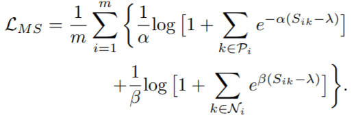
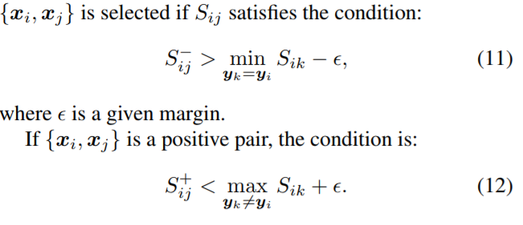

## Multi-Similarity Loss with General Pair Weighting for Deep Metric Learning
Tensorflow Implementation of Multi-Similarity Loss with General Pair Weighting for Deep Metric Learning. [ref](http://openaccess.thecvf.com/content_CVPR_2019/papers/Wang_Multi-Similarity_Loss_With_General_Pair_Weighting_for_Deep_Metric_Learning_CVPR_2019_paper.pdf)

official codes: https://github.com/MalongTech/research-ms-loss

### MS loss


### MS mining


## Reference
```
@inproceedings{wang2019multi,
  title={Multi-Similarity Loss with General Pair Weighting for Deep Metric Learning},
  author={Wang, Xun and Han, Xintong and Huang, Weilin and Dong, Dengke and Scott, Matthew R},
  booktitle={Proceedings of the IEEE Conference on Computer Vision and Pattern Recognition},
  pages={5022--5030},
  year={2019}
}
```
